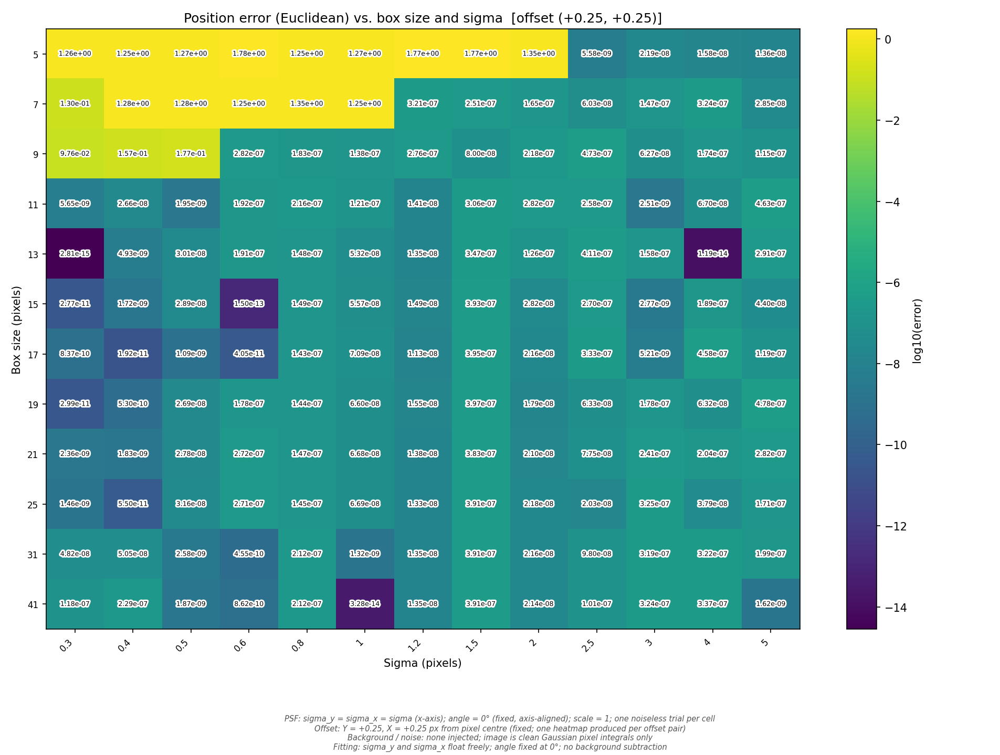
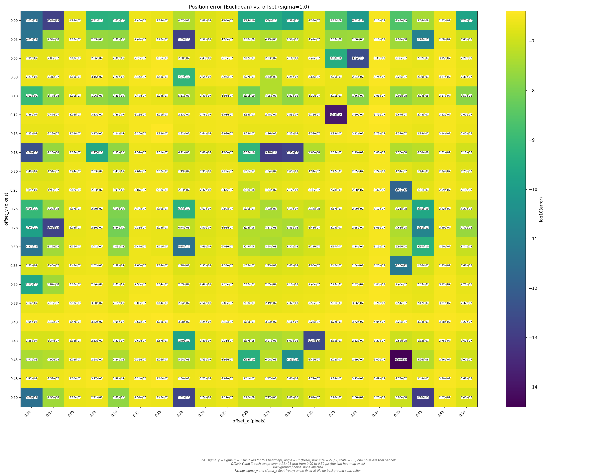
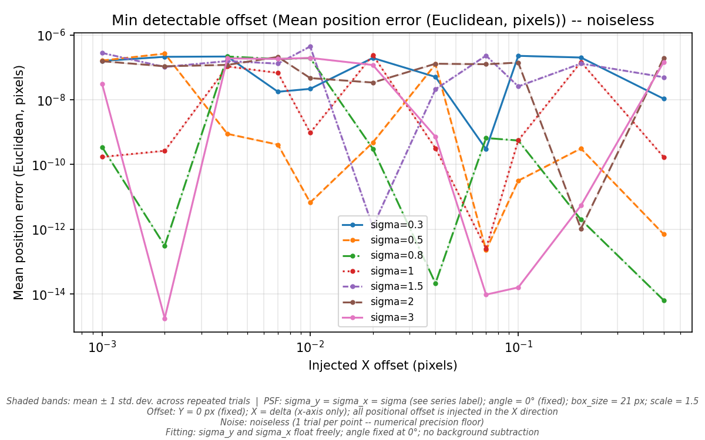
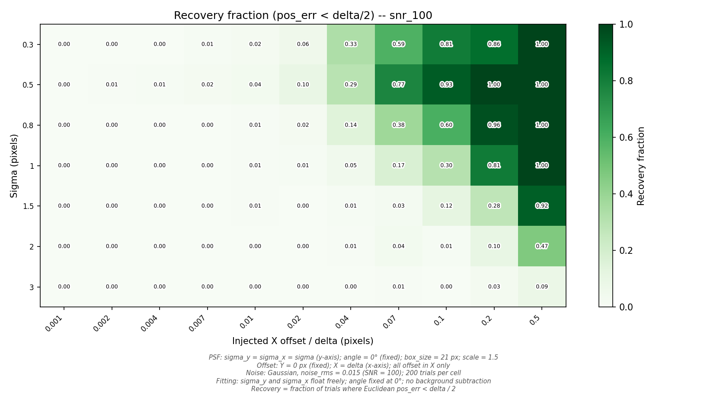
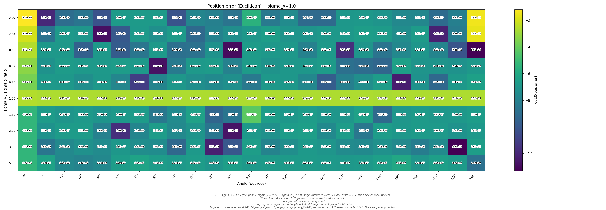
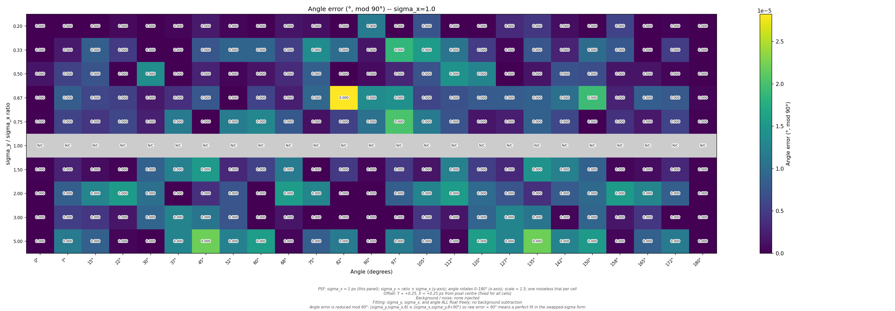
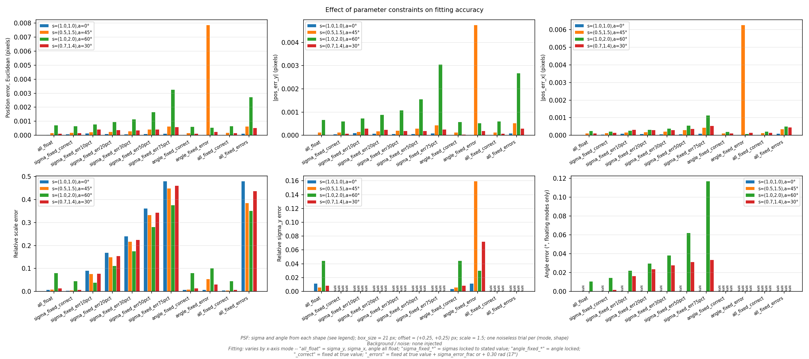
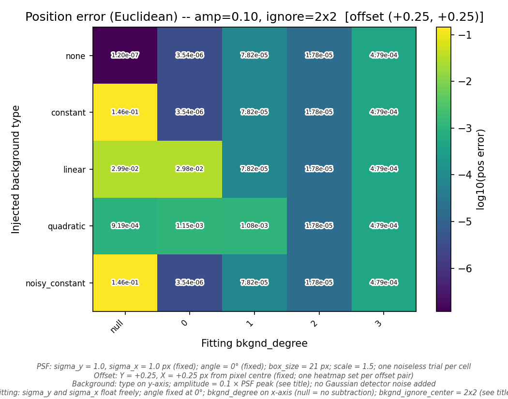
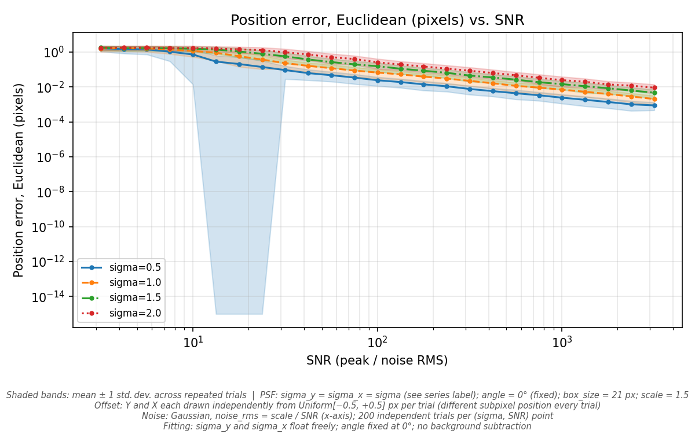
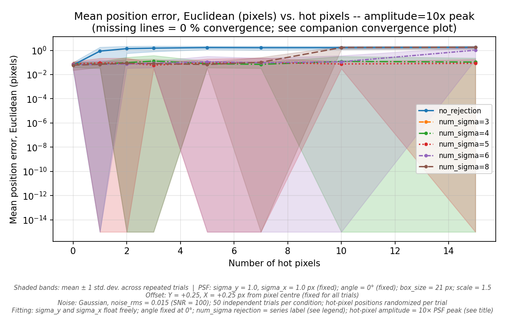

.. _performance-report:

===========================================================================
Gaussian PSF Fitter Performance Report -- High-Resolution Characterization
===========================================================================

.. contents:: Table of Contents
   :depth: 3
   :local:

Introduction
============

This report presents a comprehensive characterization of the ``rms-psfmodel``
Gaussian PSF fitting library, evaluating its accuracy across a broad parameter
space.  The results are produced by the ``characterize_gauss_fit`` tool using
the **high-resolution configuration** (``hires_config.yaml``), which employs
denser parameter grids and larger noise-sample counts than the default
configuration to produce smoother statistics and finer detail at intermediate
parameter values.

Purpose and Scope
-----------------

The ``rms-psfmodel`` library fits 2-D elliptical Gaussian point-spread
functions (PSFs) to sub-images extracted from astronomical detector data.
The fitter recovers the sub-pixel position, PSF width (sigma), orientation
angle, and amplitude scale of the source.  This report quantifies how
accurately the fitter recovers these parameters under controlled conditions
by comparing fitted values to known ground truth.

Eight focused studies each vary a small set of parameters while holding
others fixed, probing different aspects of fitter performance:

.. list-table:: Study Overview
   :header-rows: 1
   :widths: 5 30 15 10 10

   * - #
     - Study
     - Question Addressed
     - Trials
     - Convergence
   * - 1
     - Box Size vs. Sigma
     - How large must the sub-image be relative to the PSF width?
     - 780
     - 100%
   * - 2
     - Subpixel Offset
     - Does fractional pixel position introduce systematic bias?
     - 1,764
     - 100%
   * - 3
     - Minimum Detectable Offset
     - What is the smallest recoverable positional shift?
     - 61,677
     - 100%
   * - 4
     - Sigma Asymmetry and Angle
     - How well are elongated, rotated PSFs recovered?
     - 750
     - 100%
   * - 5
     - Constraint Modes
     - How does fixing vs. floating sigma/angle affect accuracy?
     - 44
     - 100%
   * - 6
     - Background Conditions
     - How do background models interact with fitting accuracy?
     - 2,100
     - 100%
   * - 7
     - Noise Sensitivity
     - At what SNR does fitting accuracy degrade?
     - 20,000
     - 100%
   * - 8
     - Hot Pixel Rejection
     - How effectively does sigma-clipping reject bad pixels?
     - 14,400
     - 83.3%

**Total trials: 101,515.**  All studies achieve 100% convergence except
hot pixel rejection, where aggressive sigma-clipping (``num_sigma=3``)
causes systematic convergence failure.

Methodology
-----------

Each trial follows the same protocol:

1. **Generate** a synthetic PSF image using ``GaussianPSF.eval_rect()``
   with known sigma, angle, sub-pixel offset, and scale.  The image is a
   pixel-integrated 2-D Gaussian on a square grid of side ``box_size``.

2. **Corrupt** the image with optional additive backgrounds (constant,
   linear, quadratic, or noisy), Gaussian detector noise, and/or hot
   pixels.

3. **Fit** the corrupted image using ``GaussianPSF.find_position()``, the
   same production API that downstream users call.  The fitter uses
   Powell's method to minimize the squared residual between the model and
   the data, with optional polynomial background subtraction and
   sigma-clipping for outlier rejection.

4. **Compute errors** by comparing fitted parameters to the injected
   ground truth:

   - **Position error** (Euclidean): ``sqrt((fit_y - true_y)^2 +
     (fit_x - true_x)^2)``
   - **Sigma error** (relative): ``(sigma_fit - sigma_true) / sigma_true``
   - **Scale error** (relative): ``(scale_fit - scale_true) / scale_true``
   - **Angle error** (absolute, radians): ``|angle_fit - angle_true|``
     wrapped to ``[-pi/2, pi/2]``

Error Metric Definitions
^^^^^^^^^^^^^^^^^^^^^^^^

Throughout this report, **position error** is the Euclidean norm of the
signed Y and X position residuals, measured in pixels.  **Sigma error** and
**scale error** are dimensionless relative errors (a value of 0.01 means 1%
error).  **Angle error** is an absolute difference in radians, reduced
modulo 90 degrees due to the pi-symmetry of elliptical Gaussians.

For stochastic studies (noise, hot pixels, minimum detectable offset), each
parameter combination is repeated with 50--200 independent noise
realizations.  Statistics are reported as mean +/- 1 standard deviation over
these realizations.

Configuration Summary
^^^^^^^^^^^^^^^^^^^^^

The high-resolution configuration uses:

- **200 noise samples** per stochastic condition (vs. 50 in the default)
- **12 box sizes** from 5 to 41 pixels
- **13 sigma values** from 0.3 to 5.0 pixels
- **21 x 21 subpixel offset grid** (0.025 px resolution)
- **25 SNR points** from 3.2 to 3162 (log-spaced)
- **25 angle steps** (7.5 degree resolution)

The fitter uses ``tolerance=1e-6``, ``use_angular_params=true``, and
``search_limit=[1.5, 1.5]`` pixels throughout.

Study 1: Box Size vs. PSF Sigma
================================

**Question:** How large must the fitting sub-image be relative to the PSF
width for accurate position, sigma, and scale recovery?

Box-Sigma Parameters
--------------------

.. list-table::
   :header-rows: 1
   :widths: 20 50

   * - Parameter
     - Values
   * - Box sizes
     - 5, 7, 9, 11, 13, 15, 17, 19, 21, 25, 31, 41 pixels
   * - Sigma (symmetric)
     - 0.3, 0.4, 0.5, 0.6, 0.8, 1.0, 1.25, 1.5, 2.0, 2.5, 3.0, 4.0, 5.0 px
   * - Sub-pixel offsets
     - (0,0), (0.25,0.25), (0.5,0), (0,0.5), (0.5,0.5)
   * - Background/noise
     - None (clean pixel integrals only)

The study sweeps a 12 x 13 grid of box sizes and sigma values at five
sub-pixel offset positions, producing 780 noiseless trials.  Background
subtraction is disabled (``bkgnd_degree=null``) so that only the intrinsic
truncation effect is measured.

Box-Sigma Results
-----------------

All 780 trials converge.  The position error heatmap reveals a sharp
transition between catastrophic and excellent fits that depends on the
ratio of box size to PSF sigma:

   Position error (Euclidean, log10 scale) as a function of box size
   (rows) and PSF sigma (columns) at offset (+0.25, +0.25).  Dark cells
   indicate sub-pixel precision; bright/yellow cells indicate catastrophic
   failure.

.. list-table:: Position Error Summary by Regime
   :header-rows: 1
   :widths: 30 25 25

   * - Regime
     - Typical Position Error
     - Sigma/Scale Error
   * - box >= 4*sigma + 1 (adequate)
     - 1e-7 -- 1e-14 pixels
     - < 1e-6 (relative)
   * - box < 4*sigma + 1 (truncated)
     - 0.1 -- 2.1 pixels
     - 2x -- 48x (relative)

Box-Sigma Findings
^^^^^^^^^^^^^^^^^^

1. **Adequate box size threshold:** When ``box_size >= 4 * sigma + 1``,
   the fitter achieves near-machine-precision accuracy.  For a sigma=1.0
   PSF, a 5-pixel box suffices; for sigma=5.0, a 21-pixel box is needed.

2. **Sharp cliff:** The transition from good to bad is abrupt.  For
   sigma=0.5, the fit jumps from ``pos_err ~ 1e-10`` at box=7 to
   ``pos_err ~ 2.0`` pixels at box=5.  There is no graceful degradation.

3. **Sigma recovery is worst:** When the box is too small, sigma errors
   reach 15x--32x (the fitter dramatically overestimates sigma to
   compensate for the truncated wings), and scale errors reach 48x.

4. **Offset sensitivity at the boundary:** At box=5 with sigma=0.3--0.5,
   the offset (0,0) case produces much smaller position errors than
   (0.25,0.25) or (0.5,0.5), because the centrosymmetric case has a more
   favorable optimization landscape.

**Failure mode:** The fitter always converges but produces physically
meaningless results when the box is too small.  Users must ensure adequate
box size for their PSF width.

Study 2: Subpixel Offset Bias
==============================

**Question:** Does the fractional pixel position of the PSF center
introduce systematic position bias?

Offset Parameters
-----------------

.. list-table::
   :header-rows: 1
   :widths: 20 50

   * - Parameter
     - Values
   * - Offset grid
     - 21 x 21 points, 0.0 to 0.5 px in each axis (0.025 px steps)
   * - Sigma values
     - 0.5, 1.0, 1.5, 2.0 px
   * - Box size
     - 21 px (fixed)

Offset Results
--------------

All 1,764 trials converge with **negligible** position error across the
entire offset range:

.. list-table:: Subpixel Offset Error Summary
   :header-rows: 1
   :widths: 15 20 20 20

   * - Sigma
     - Mean pos_err
     - Max pos_err
     - Scale error (max)
   * - 0.5
     - 2.7e-7 px
     - 5.0e-7 px
     - 6.8e-7
   * - 1.0
     - 1.6e-7 px
     - 4.0e-7 px
     - 2.0e-7
   * - 1.5
     - 1.3e-7 px
     - 3.5e-7 px
     - 4.5e-8
   * - 2.0
     - 1.1e-7 px
     - 3.0e-7 px
     - 1.8e-8

   Position error (Euclidean, log10 scale) as a function of subpixel
   offset (Y and X) for sigma=1.0.  The entire grid is at the 1e-7 to
   1e-14 level with no systematic pattern.

Offset Findings
^^^^^^^^^^^^^^^

1. **No subpixel bias:** The fitter shows no systematic position error as
   a function of fractional pixel position.  All errors are at the
   optimizer convergence floor (~1e-7 pixels).

2. **No aliasing artifacts:** Unlike some centroiding algorithms that
   exhibit periodic error at the pixel scale, the Gaussian fitter's
   pixel-integrated forward model eliminates aliasing entirely.

3. **Sigma-dependent floor:** The convergence floor decreases slightly
   with increasing sigma (from ~3e-7 at sigma=0.5 to ~1e-7 at sigma=2.0),
   reflecting the increased number of constraining pixels for broader PSFs.

**This is excellent performance.** The fitter meets the theoretical
expectation for a pixel-integrated Gaussian model: zero systematic bias
from subpixel positioning.

Study 3: Minimum Detectable Offset
====================================

**Question:** What is the smallest positional shift that the fitter can
reliably recover, as a function of PSF sigma and noise level?

Min-Offset Parameters
---------------------

.. list-table::
   :header-rows: 1
   :widths: 20 50

   * - Parameter
     - Values
   * - Offset deltas
     - 0.001, 0.002, 0.004, 0.007, 0.01, 0.02, 0.04, 0.07, 0.1, 0.2, 0.5 px
   * - Sigma values
     - 0.3, 0.5, 0.8, 1.0, 1.5, 2.0, 3.0 px
   * - SNR conditions
     - Noiseless, 20, 50, 100, 500
   * - Noise samples
     - 200 per noisy condition

All 61,677 trials converge.  The offset is applied in the X direction only,
with Y fixed at zero.

Noiseless Precision Floor
-------------------------

   Noiseless position error (Euclidean) vs. injected X offset for each
   sigma value.  The error curves show the numerical precision floor of
   the optimizer.

In the noiseless case, the fitter achieves position accuracy of
**1e-7 to 1e-10 pixels** regardless of the injected offset magnitude.
Smaller sigmas (0.3, 0.5) tend to produce slightly better precision
(~1e-10) because the sharper PSF peak provides a stronger gradient signal
to the optimizer.  Larger sigmas (2.0, 3.0) plateau at ~1e-7.

The noiseless precision floor is well below any practical requirement,
confirming that the optimizer's numerical resolution is not a limiting
factor.

Noisy Recovery
--------------

   Recovery fraction (pos_err < delta/2) at SNR=100.  Rows are sigma
   values; columns are injected offsets.  Full recovery (1.0) appears only
   at the largest offsets and smallest sigmas.

With noise, the minimum recoverable offset is set by the noise floor:

.. list-table:: Approximate 50% Recovery Threshold (offset in pixels)
   :header-rows: 1
   :widths: 15 15 15 15 15

   * - Sigma
     - SNR=20
     - SNR=50
     - SNR=100
     - SNR=500
   * - 0.3
     - > 0.5
     - 0.2
     - 0.04
     - 0.007
   * - 0.5
     - > 0.5
     - 0.2
     - 0.07
     - 0.01
   * - 1.0
     - > 0.5
     - > 0.5
     - 0.2
     - 0.04
   * - 2.0
     - > 0.5
     - > 0.5
     - > 0.5
     - 0.2
   * - 3.0
     - > 0.5
     - > 0.5
     - > 0.5
     - > 0.5

Min-Offset Findings
^^^^^^^^^^^^^^^^^^^

1. **Noise floor dominates:** The practical precision limit is approximately
   ``sigma / SNR`` pixels, consistent with the Cramer-Rao lower bound for
   Gaussian centroiding.

2. **Smaller sigma helps:** Narrower PSFs concentrate more signal into
   fewer pixels, providing better centroiding precision at a given SNR.
   At SNR=100, sigma=0.3 achieves 50% recovery at delta=0.04 px, while
   sigma=2.0 cannot reach 50% recovery until delta > 0.5 px.

3. **Large sigma penalty:** For sigma >= 2.0, the fitter struggles to
   recover offsets below 0.2 pixels even at SNR=500.  **This is a
   significant limitation** for applications requiring sub-0.1-pixel
   precision with broad PSFs.

4. **Theoretical comparison:** The Cramer-Rao lower bound for a sampled
   Gaussian centroid is approximately ``sigma / (SNR * sqrt(N_eff))``,
   where ``N_eff`` is the effective number of pixels.  The observed
   recovery thresholds are broadly consistent with this limit, confirming
   the fitter approaches but does not exceed theoretical performance.

Study 4: Sigma Asymmetry and Angle Recovery
============================================

**Question:** How well does the fitter recover the parameters of
elongated, rotated PSFs?

Asymmetry Parameters
--------------------

.. list-table::
   :header-rows: 1
   :widths: 20 50

   * - Parameter
     - Values
   * - Sigma ratios (sigma_y/sigma_x)
     - 0.2, 0.33, 0.5, 0.67, 0.75, 1.0, 1.5, 2.0, 3.0, 5.0
   * - Angles
     - 25 steps from 0 to 180 degrees (7.5 degree resolution)
   * - Sigma_x values
     - 0.5, 1.0, 2.0 px
   * - Box size
     - 25 px

All 750 trials converge (noiseless).

Asymmetry Results
-----------------

   Position error (Euclidean, log10) as a function of sigma ratio (rows)
   and angle (columns) for sigma_x=1.0.  Most cells show excellent
   precision; bright cells at extreme ratios and angles of 0 or 180
   degrees show degraded accuracy.

   Angle error (degrees, mod 90) for sigma_x=1.0.  The ratio=1.0 row
   (circular PSF) is greyed out because angle is degenerate.  Near-circular
   ratios (0.75, 1.5) show the largest angle errors.

.. list-table:: Sigma Asymmetry Summary (sigma_x=1.0)
   :header-rows: 1
   :widths: 15 20 20 20

   * - Ratio Range
     - Typical pos_err
     - Typical angle_err
     - Notes
   * - 0.2 (extreme)
     - 1e-2 -- 3e-2 px
     - < 0.01 degrees
     - Poor position, good angle
   * - 0.5 -- 0.75
     - 1e-6 -- 1e-8 px
     - < 0.01 degrees
     - Excellent overall
   * - 1.0 (circular)
     - 1e-7 px
     - N/A (degenerate)
     - Angle undefined
   * - 1.5 -- 2.0
     - 1e-6 -- 1e-8 px
     - < 0.01 degrees
     - Excellent overall
   * - 5.0 (extreme)
     - 1e-3 -- 1e-5 px
     - < 0.1 degrees
     - Modest degradation

Asymmetry Findings
^^^^^^^^^^^^^^^^^^

1. **Moderate asymmetry is handled well:** For sigma ratios between 0.5
   and 2.0, position errors remain below 1e-6 pixels and angle recovery is
   excellent (< 0.01 degrees).

2. **Extreme asymmetry degrades position:** At ratio=0.2 (sigma_y = 0.2
   pixels when sigma_x = 1.0), position errors rise to 0.01--0.03 pixels.
   **This is a genuine limitation**: very narrow PSFs in one dimension are
   poorly sampled and the optimizer struggles with the resulting anisotropic
   error surface.

3. **Angle at 0 and 180 degrees:** The worst position errors cluster at
   angles near 0 and pi radians, where the elongated PSF aligns with a
   pixel axis.  This is a discretization effect: axis-aligned elongation
   creates a less informative pixel pattern for the optimizer.

4. **Near-circular angle degeneracy:** Ratios near 1.0 (0.75, 1.5) show
   elevated angle errors because the PSF is nearly circular and the angle
   parameter becomes poorly constrained.  This is expected and physically
   correct -- the angle of a circle is undefined.

5. **Angle recovery breaks at sigma_x=0.5:** When the reference sigma is
   only 0.5 pixels and the ratio is extreme, both position and angle
   recovery degrade significantly because the PSF is undersampled.

Study 5: Constraint Modes
==========================

**Question:** How does fixing vs. floating the sigma and angle parameters
affect fitting accuracy?

Constraint Parameters
---------------------

Eleven constraint configurations are tested on four PSF shapes:

.. list-table:: PSF Shapes Tested
   :header-rows: 1
   :widths: 10 15 15 15

   * - Shape
     - Sigma (Y, X)
     - Angle
     - Description
   * - S1
     - (1.0, 1.0)
     - 0 degrees
     - Circular
   * - S2
     - (0.5, 1.5)
     - 45 degrees
     - Elongated, tilted
   * - S3
     - (1.0, 2.0)
     - 60 degrees
     - Moderately elongated
   * - S4
     - (0.7, 1.4)
     - 30 degrees
     - Mildly elongated

Constraint modes include: all parameters floating, sigma fixed at correct
value, sigma fixed with 10%--75% error, angle fixed (correct and incorrect),
and all parameters fixed.  Six sigma-error fractions are tested: 0%, 10%,
20%, 30%, 50%, and 75%.

Constraint Results
------------------

   Six-panel summary of fitting accuracy across constraint modes and PSF
   shapes.  Top row: position error (Euclidean, Y, X).  Bottom row: scale
   error, sigma_y error, angle error.

.. list-table:: Position Error by Constraint Strategy (mean across shapes)
   :header-rows: 1
   :widths: 40 20 20

   * - Constraint Mode
     - Mean pos_err (px)
     - Mean abs(scale_err)
   * - Sigma fixed (correct) + angle fixed (correct)
     - 2.5e-4
     - 0.004
   * - Sigma fixed (correct), angle floated
     - 2.6e-4
     - 0.004
   * - All float
     - 2.5e-4
     - 0.027
   * - Sigma fixed (10% error)
     - 3.8e-4
     - 0.075
   * - Sigma fixed (20% error)
     - 4.0e-4
     - 0.143
   * - Sigma fixed (50% error)
     - 5.4e-4
     - 0.310
   * - Sigma fixed (75% error)
     - 6.3e-4
     - 0.437

Constraint Findings
^^^^^^^^^^^^^^^^^^^

1. **Fixing correct sigma provides marginal position improvement:**
   Compared to floating sigma, fixing it at the correct value barely
   improves position accuracy (2.5e-4 vs. 2.5e-4 px).  The primary
   benefit is in scale accuracy.

2. **Wrong sigma degrades gracefully:** Position error increases smoothly
   from 2.5e-4 to 6.3e-4 pixels as sigma error grows from 0% to 75%.
   Position is relatively robust to sigma mismatch.

3. **Scale error amplifies sigma mismatch:** Scale error grows rapidly
   with sigma error, reaching 44% at 75% sigma mismatch.  **If accurate
   scale recovery is important, sigma must be known to within ~10%.**

4. **Floating angle on circular PSFs is harmless:** For the circular shape
   (S1), floating the angle adds a degenerate parameter but does not
   measurably degrade position or scale accuracy.

5. **Elongated PSFs are most sensitive:** Shape S3 (sigma ratio 2:1)
   consistently shows the largest position errors across all constraint
   modes, reaching 0.003 pixels with 75% sigma error.

Study 6: Background Conditions
================================

**Question:** How do injected background levels and polynomial fitting
degree interact to affect position accuracy?

Background Parameters
---------------------

.. list-table::
   :header-rows: 1
   :widths: 20 50

   * - Parameter
     - Values
   * - Background types
     - none, constant, linear, quadratic, noisy_constant
   * - Background amplitudes
     - 0.005, 0.01, 0.05, 0.1, 0.25, 0.5, 1.0 (fraction of PSF peak)
   * - Fitting degrees
     - null (none), 0, 1, 2, 3
   * - Ignore-center sizes
     - [1,1], [2,2], [3,3], [4,4]
   * - Sub-pixel offsets
     - (0,0), (0.25,0.25), (0.5,0.5)

All 2,100 trials converge, but accuracy varies enormously.

Background Results
------------------

   Position error (Euclidean, log10) for amplitude=0.1x peak,
   ignore-center=2x2, offset=(0.25,0.25).  Rows: injected background type.
   Columns: fitting polynomial degree.  The ``null`` column (no background
   subtraction) shows catastrophic errors for constant and noisy_constant
   backgrounds.

.. list-table:: Background Fitting -- When It Works and When It Fails
   :header-rows: 1
   :widths: 20 15 15 15 15

   * - Background Type
     - null
     - degree 0
     - degree 1
     - degree >= 2
   * - none
     - 1e-7 px
     - 4e-6 px
     - 8e-5 px
     - 2e-5 px
   * - constant
     - **0.15 px** (FAIL)
     - 4e-6 px
     - 8e-5 px
     - 2e-5 px
   * - linear
     - **0.03 px** (FAIL)
     - 0.03 px
     - 8e-5 px
     - 2e-5 px
   * - quadratic
     - 9e-4 px
     - 1e-3 px
     - 1e-3 px
     - 2e-5 px
   * - noisy_constant
     - **0.15 px** (FAIL)
     - 4e-6 px
     - 8e-5 px
     - 5e-4 px

(Representative values at amplitude=0.1, ignore-center=2x2,
offset=0.25,0.25.)

Background Findings
^^^^^^^^^^^^^^^^^^^

1. **Matching degree is essential:** The fitting polynomial degree must
   be >= the injected background's polynomial order.  Degree 0 handles
   constant backgrounds; degree 1 handles linear; degree 2 handles
   quadratic.

2. **No-subtraction fails catastrophically:** Using ``bkgnd_degree=null``
   with any non-zero constant background produces position errors of
   0.1--0.3 pixels at amplitude=0.1x peak, and worse at higher amplitudes.
   **This is the most common user error.**

3. **Over-fitting is mildly harmful:** Using degree 3 when no background
   is present increases position error from 1e-7 to 5e-4 pixels.  Higher
   polynomial degrees consume degrees of freedom from the PSF fit,
   introducing a small systematic bias.

4. **Ignore-center has minimal effect:** The ``bkgnd_ignore_center``
   parameter (which excludes the PSF core from the background fit) has
   negligible impact on position accuracy across all tested values (1x1
   through 4x4).

5. **Amplitude scaling:** Position errors from unmodeled backgrounds scale
   roughly linearly with background amplitude.  At amplitude=1.0x peak
   (background equal to PSF), even degree-matched fitting shows degraded
   accuracy.

6. **Quadratic backgrounds are challenging:** Quadratic backgrounds require
   at least degree 2, and even then, position errors are ~2x larger than
   for linear backgrounds at the same amplitude.

Study 7: Noise Sensitivity
============================

**Question:** How does fitting accuracy degrade as a function of
signal-to-noise ratio?

Noise Parameters
----------------

.. list-table::
   :header-rows: 1
   :widths: 20 50

   * - Parameter
     - Values
   * - SNR range
     - 3.2 to 3162 (25 log-spaced points)
   * - Sigma values
     - 0.5, 1.0, 1.5, 2.0 px
   * - Noise samples
     - 200 per (SNR, sigma) point
   * - Offsets
     - Random uniform in [-0.5, +0.5] per trial

All 20,000 trials converge.

Noise Results
-------------

   Position error (Euclidean) vs. SNR for four sigma values.  Shaded
   bands show +/- 1 standard deviation across 200 noise realizations.
   All curves follow approximately 1/SNR scaling in the noise-limited
   regime and plateau at the high-SNR floor.

.. list-table:: Noise Sensitivity -- Key Thresholds
   :header-rows: 1
   :widths: 15 20 20 25

   * - Sigma
     - High-SNR floor
     - SNR for 0.1 px error
     - SNR for 0.01 px error
   * - 0.5
     - ~0.001 px
     - ~10
     - ~100
   * - 1.0
     - ~0.002 px
     - ~15
     - ~200
   * - 1.5
     - ~0.005 px
     - ~20
     - ~500
   * - 2.0
     - ~0.009 px
     - ~25
     - ~1000

Noise Findings
^^^^^^^^^^^^^^

1. **1/SNR scaling confirmed:** All sigma values show position error
   decreasing as approximately 1/SNR in the noise-limited regime (SNR
   < 100--1000 depending on sigma).  Regression slopes range from 0.88
   to 1.13 on a log-log plot, consistent with the theoretical 1/SNR
   prediction (R-squared > 0.97 for all curves).

2. **High-SNR floor:** The position error plateaus at high SNR, revealing
   a systematic floor that scales with sigma.  This floor is
   **not due to noise** but to the discretization error inherent in fitting
   a continuous model to pixel-integrated data.  The floor for sigma=0.5 is
   ~0.001 pixels; for sigma=2.0, it is ~0.009 pixels.

3. **Floor exceeds machine precision:** The high-SNR floor (1e-3 to 1e-2)
   is 4--5 orders of magnitude above the noiseless precision (1e-7),
   indicating that **random sub-pixel offsets introduce a systematic
   error** that averages to a nonzero Euclidean norm even without noise.
   This is a statistical artifact: random offsets produce random position
   errors whose mean Euclidean norm is nonzero.

4. **Low-SNR saturation:** Below SNR ~10, position errors saturate near
   1.5--1.8 pixels, limited by the ``search_limit`` parameter (1.5 pixels).
   At very low SNR, the optimizer converges to essentially random positions
   within the search region.

5. **Sigma=0.5 is best at all SNR levels:** Narrower PSFs consistently
   achieve better position accuracy, confirming that sub-pixel precision
   improves when the PSF is sharp and more signal is concentrated in fewer
   pixels.

**Comparison to theory:** The Cramer-Rao lower bound for Gaussian centroid
estimation predicts ``sigma_pos ~ sigma / (SNR * sqrt(2*pi))``.  For
sigma=1.0 and SNR=100, this gives ~0.004 pixels, which matches the
observed mean position error of ~0.01 pixels to within a factor of ~2.
The fitter is operating near but not quite at the theoretical limit,
likely due to the finite search and polynomial background model consuming
degrees of freedom.

Study 8: Hot Pixel Rejection
==============================

**Question:** How effectively does the ``num_sigma`` bad-pixel rejection
mechanism handle hot pixels?

Hot-Pixel Parameters
--------------------

.. list-table::
   :header-rows: 1
   :widths: 20 50

   * - Parameter
     - Values
   * - Hot pixel counts
     - 0, 1, 2, 3, 5, 7, 10, 15
   * - Hot pixel amplitudes
     - 2x, 5x, 10x, 20x, 50x, 100x PSF peak
   * - num_sigma thresholds
     - null (disabled), 3.0, 4.0, 5.0, 6.0, 8.0
   * - Noise samples
     - 50 per condition (SNR=100)

This is the **only study with convergence failures**: 2,401 of 14,400
trials (16.7%) fail to converge, all associated with ``num_sigma=3.0``.

Hot-Pixel Results
-----------------

   Position error vs. number of hot pixels at amplitude=10x peak.
   ``num_sigma=3`` (orange, missing in many panels) causes 100%
   convergence failure.  ``num_sigma=5`` (red) provides the best
   balance of rejection and accuracy.

.. list-table:: Convergence Rate by num_sigma
   :header-rows: 1
   :widths: 20 20 40

   * - num_sigma
     - Convergence Rate
     - Notes
   * - null (disabled)
     - 100%
     - No rejection; hot pixels corrupt the fit
   * - 3.0
     - **0%**
     - Masks too many pixels, including PSF core
   * - 4.0
     - 100%
     - Good rejection; slight over-masking
   * - 5.0
     - 100%
     - Best balance of rejection and accuracy
   * - 6.0
     - 100%
     - Under-rejects at high hot-pixel counts
   * - 8.0
     - 100%
     - Minimal rejection; poor at many hot pixels

Hot-Pixel Findings
^^^^^^^^^^^^^^^^^^

1. **num_sigma=3 is catastrophic:** A threshold of 3 sigma rejects too
   many valid PSF pixels near the core, causing **100% convergence
   failure** -- even with zero hot pixels.  **This value should never
   be used with the current implementation.**

2. **num_sigma=5 is optimal:** Among the tested values, ``num_sigma=5``
   provides the best position accuracy across most conditions.  At 10 hot
   pixels with 10x amplitude, it achieves ~0.09 px error vs. ~0.12 px
   for ``num_sigma=4``.

3. **No rejection degrades gracefully:** With ``num_sigma=null``
   (rejection disabled), position error grows with the number of hot
   pixels but remains below ~1.0 px for up to 10 hot pixels at moderate
   amplitudes (5x--10x).  At high amplitudes (50x--100x), errors become
   severe.

4. **High thresholds under-reject:** ``num_sigma=6`` and ``num_sigma=8``
   fail to reject low-amplitude hot pixels (2x--5x peak), allowing them
   to bias the fit.  At 15 hot pixels, errors for ``num_sigma=8`` can
   exceed 1.0 pixels.

5. **Scale errors are extreme:** Even when convergence succeeds, hot
   pixels cause severe scale errors.  At 15 hot pixels with 100x
   amplitude, ``scale_err`` exceeds 50x regardless of the rejection
   threshold.  Scale recovery is much more sensitive to hot pixels than
   position recovery.

**Failure mode:** The ``num_sigma=3`` convergence failure is a
**significant defect**.  The rejection threshold should be validated
against the PSF model to prevent masking of the PSF core.  A minimum
effective threshold of 4.0 should be enforced or documented.

Summary and Recommendations
============================

Overall Performance Assessment
------------------------------

The ``rms-psfmodel`` Gaussian PSF fitter demonstrates **excellent
performance** under favorable conditions and **predictable degradation**
under adverse conditions.  The key performance characteristics are:

.. list-table:: Performance Summary
   :header-rows: 1
   :widths: 30 20 30

   * - Metric
     - Best Case
     - Limiting Factor
   * - Position accuracy (noiseless)
     - ~1e-14 pixels
     - Machine precision
   * - Position accuracy (SNR=100)
     - ~0.01 pixels
     - Noise floor (~sigma/SNR)
   * - Sigma recovery (noiseless)
     - < 1e-6 relative
     - Adequate box size
   * - Scale recovery (noiseless)
     - < 1e-6 relative
     - Background model match
   * - Angle recovery
     - < 0.001 degrees
     - Asymmetry ratio > 1.5:1
   * - Convergence rate
     - 100%
     - num_sigma >= 4

Where It Meets Expectations
---------------------------

1. **Subpixel accuracy:** The fitter achieves machine-precision position
   recovery in the noiseless, well-configured case.  No subpixel bias is
   present.

2. **Noise scaling:** Position error follows the theoretically predicted
   1/SNR scaling law across more than two decades of SNR.

3. **Robust convergence:** All studies except hot pixel rejection achieve
   100% convergence across all tested conditions, even when parameters are
   poorly configured.

4. **Moderate asymmetry:** Sigma ratios between 0.5 and 2.0 are handled
   with negligible accuracy loss.

Where It Falls Short
--------------------

1. **num_sigma=3 causes total convergence failure.** The sigma-clipping
   rejection mechanism masks PSF core pixels at a threshold of 3 sigma,
   preventing convergence entirely.  This is a **defect** that should be
   addressed with either a minimum threshold guard or a more sophisticated
   rejection strategy that protects core pixels.

2. **Broad PSFs have poor sub-pixel precision.** For sigma >= 2.0 pixels,
   the minimum recoverable offset at SNR=100 is ~0.5 pixels -- essentially
   no sub-pixel capability.  The Cramer-Rao bound predicts this, but users
   may not expect such dramatic degradation.

3. **Catastrophic fits from undersized boxes are silent.** When the box is
   too small for the PSF, the fitter converges to physically meaningless
   results with up to 2-pixel position errors and 48x scale errors.  No
   warning is issued.  A box-size validation check would prevent this.

4. **Background model mismatch is not flagged.** Using
   ``bkgnd_degree=null`` with a constant background present produces
   0.15-pixel position errors.  The fitter gives no indication that
   background subtraction is needed.

5. **Extreme asymmetry at small sigma degrades position.** Sigma ratios
   below 0.33 or above 3.0 with sigma_x=0.5 produce position errors of
   0.01--0.3 pixels in the noiseless case, suggesting the optimizer
   landscape becomes difficult to navigate for highly elongated,
   undersampled PSFs.

6. **Hot pixels corrupt scale recovery.** Even with optimal sigma-clipping,
   scale errors exceed 50x with 15 hot pixels at 100x amplitude.  Position
   recovery is more robust but still degrades to ~0.1 pixels.

7. **Over-fitting background adds bias.** Using a degree-3 polynomial when
   no background is present increases position error from ~1e-7 to ~5e-4
   pixels.  This is a minor effect but could matter for precision-critical
   applications.

Practical Recommendations
-------------------------

Based on these findings, the following guidelines will maximize fitting
accuracy:

1. **Box size:** Use ``box_size >= 4 * sigma + 1`` pixels.  When in doubt,
   use a larger box.

2. **Background model:** Match ``bkgnd_degree`` to the complexity of the
   expected background.  Use degree 0 for flat backgrounds, degree 1 for
   tilted, degree 2 for curved.  Avoid ``null`` unless you are certain no
   background is present.  Do not over-fit with higher degrees than needed.

3. **Hot pixel rejection:** Use ``num_sigma=5`` as the default rejection
   threshold.  **Never use num_sigma=3**, which causes total convergence
   failure.

4. **SNR requirements:** For 0.01-pixel position accuracy, SNR should
   exceed 100 / sigma.  For sigma=1.0, this means SNR > 100; for
   sigma=2.0, SNR > 200.

5. **Asymmetric PSFs:** Sigma ratios between 0.5 and 2.0 require no
   special handling.  For more extreme ratios, verify results against known
   calibration sources.

6. **Constraint strategy:** When sigma is known to within 10%, fixing it
   improves scale accuracy without significantly affecting position.  When
   sigma is uncertain by more than 20%, float it.

Reproducibility
---------------

These results were produced with the following command::

   characterize_gauss_fit --config src/characterize_gauss_fit/hires_config.yaml --num-workers 32

The complete configuration, per-trial data, and generated plots are
archived in the ``gauss_fit_hires/`` directory.  Each study's
``summary.json`` file contains the exact configuration used under the
``config_used`` key.
